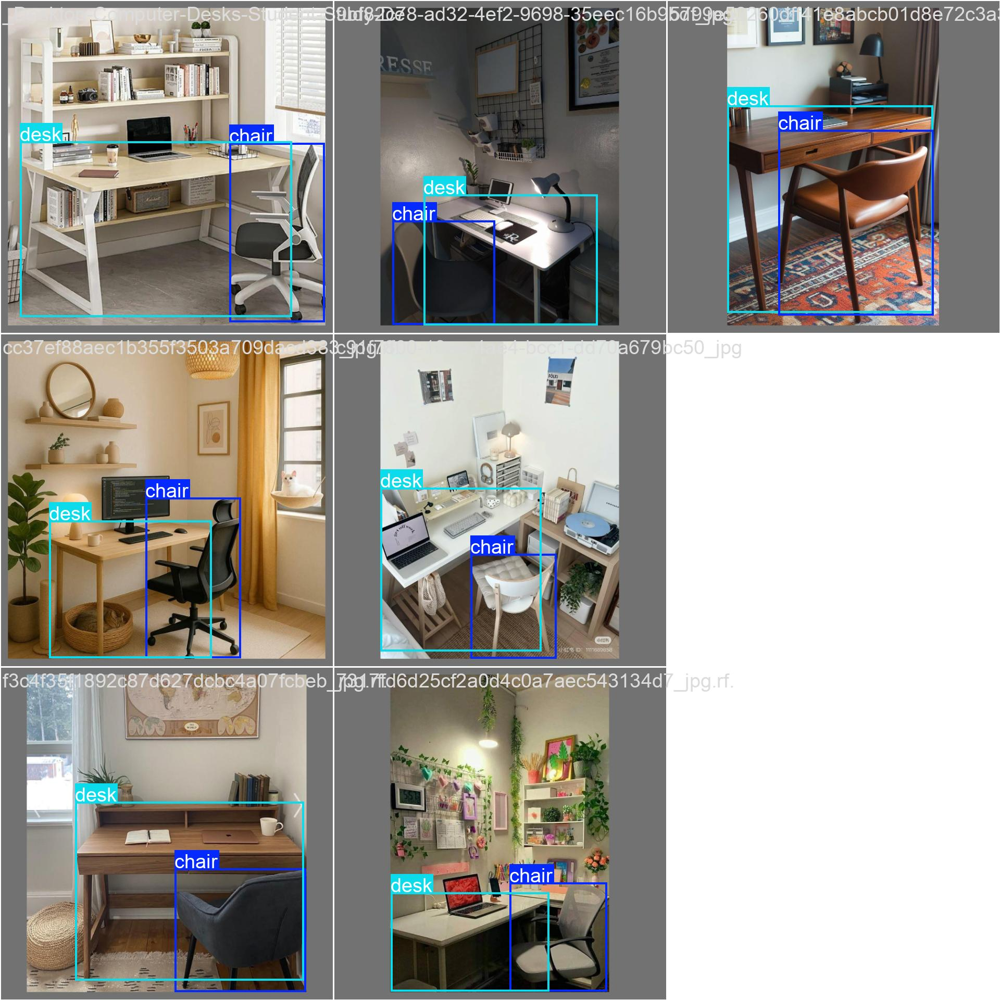

🌱 YOLOv8 Object Detection - Data Labeling Portfolio🌱

Ini adalah proyek portofolio data labeling dan pelatihan model YOLOv8 yang saya kerjakan menggunakan dataset custom untuk mendeteksi objek **Meja** dan **Kursi**.

Proyek ini mencakup proses:
- Data labeling (annotasi bounding box)
- Setup konfigurasi YOLOv8
- Training dan validasi model
- Inference untuk menguji model

---

📁 Struktur Folder 

yolov8-labeling-project/

├── [📄 Lihat file data.yaml](data/data.yaml)

├── 📂 [Buka folder `train`](./train/) # Data training

├── 📂 [Buka folder `valid`](./valid/) # Data validasi

├── 📂 [Buka folder `test`](./test/) # Data pengujian

├── README.md # Dokumentasi proyek

├── [📄 Lihat file best(2).pt](./data/best(2).pt) # Model hasil training

├── [📄 Lihat file results.md](./data/results.md)  # Catatan hasil training/inference

---

## 📦 Dataset

Dataset dibuat dan dilabeli secara manual menggunakan Roboflow, lalu diekspor dalam format YOLOv8. Label terdiri dari beberapa kelas objek relevan dengan kasus nyata.

- Jumlah gambar train: **25**
- Jumlah gambar valid: **7**
- Jumlah kelas: **(otomatis terdeteksi dari `data.yaml`)**

---

> ⚠️ Gambar & label hanya digunakan untuk keperluan edukasi dan demonstrasi portofolio.

---

## ⚙️ Model Training

Model dilatih menggunakan YOLOv8 dari library `ultralytics`.

- Training dilakukan di Google Colab 
- Hasil disimpan di: `yolov8-training/best.pt`

---

## 🔍 Inference & Evaluasi

New https://pypi.org/project/ultralytics/8.3.155 available 😃 Update with 'pip install -U ultralytics'
Ultralytics YOLOv8.2.103 🚀 Python-3.11.13 torch-2.6.0+cu124 CUDA:0 (Tesla T4, 15095MiB)
engine/trainer: task=detect, mode=train, model=yolov8n.pt, data=/content/desk-and-chair-set-2/data.yaml, epochs=20, time=None, patience=100, batch=8, imgsz=640, save=True, save_period=-1, cache=False, device=None, workers=8, project=None, name=train, exist_ok=False, pretrained=True, optimizer=auto, verbose=True, seed=0, deterministic=True, single_cls=False, rect=False, cos_lr=False, close_mosaic=10, resume=False, amp=True, fraction=1.0, profile=False, freeze=None, multi_scale=False, overlap_mask=True, mask_ratio=4, dropout=0.0, val=True, split=val, save_json=False, save_hybrid=False, conf=None, iou=0.7, max_det=300, half=False, dnn=False, plots=True, source=None, vid_stride=1, stream_buffer=False, visualize=False, augment=False, agnostic_nms=False, classes=None, retina_masks=False, embed=None, show=False, save_frames=False, save_txt=False, save_conf=False, save_crop=False, show_labels=True, show_conf=True, show_boxes=True, line_width=None, format=torchscript, keras=False, optimize=False, int8=False, dynamic=False, simplify=True, opset=None, workspace=4, nms=False, lr0=0.01, lrf=0.01, momentum=0.937, weight_decay=0.0005, warmup_epochs=3.0, warmup_momentum=0.8, warmup_bias_lr=0.1, box=7.5, cls=0.5, dfl=1.5, pose=12.0, kobj=1.0, label_smoothing=0.0, nbs=64, hsv_h=0.015, hsv_s=0.7, hsv_v=0.4, degrees=0.0, translate=0.1, scale=0.5, shear=0.0, perspective=0.0, flipud=0.0, fliplr=0.5, bgr=0.0, mosaic=1.0, mixup=0.0, copy_paste=0.0, auto_augment=randaugment, erasing=0.4, crop_fraction=1.0, cfg=None, tracker=botsort.yaml, save_dir=runs/detect/train
WARNING: All log messages before absl::InitializeLog() is called are written to STDERR
E0000 00:00:1750081658.172358   22190 cuda_dnn.cc:8310] Unable to register cuDNN factory: Attempting to register factory for plugin cuDNN when one has already been registered
E0000 00:00:1750081658.178443   22190 cuda_blas.cc:1418] Unable to register cuBLAS factory: Attempting to register factory for plugin cuBLAS when one has already been registered
Overriding model.yaml nc=80 with nc=2

Transferred 319/355 items from pretrained weights
TensorBoard: Start with 'tensorboard --logdir runs/detect/train', view at http://localhost:6006/
Freezing layer 'model.22.dfl.conv.weight'
AMP: running Automatic Mixed Precision (AMP) checks with YOLOv8n...
AMP: checks passed ✅
train: Scanning /content/desk-and-chair-set-2/train/labels... 25 images, 0 backgrounds, 0 corrupt: 100% 25/25 [00:00<00:00, 1879.47it/s]
train: New cache created: /content/desk-and-chair-set-2/train/labels.cache
/usr/local/lib/python3.11/dist-packages/ultralytics/data/augment.py:1837: UserWarning: Argument(s) 'quality_lower' are not valid for transform ImageCompression
  A.ImageCompression(quality_lower=75, p=0.0),
albumentations: Blur(p=0.01, blur_limit=(3, 7)), MedianBlur(p=0.01, blur_limit=(3, 7)), ToGray(p=0.01, method='weighted_average', num_output_channels=3), CLAHE(p=0.01, clip_limit=(1.0, 4.0), tile_grid_size=(8, 8))
val: Scanning /content/desk-and-chair-set-2/valid/labels... 7 images, 0 backgrounds, 0 corrupt: 100% 7/7 [00:00<00:00, 830.79it/s]
val: New cache created: /content/desk-and-chair-set-2/valid/labels.cache
Plotting labels to runs/detect/train/labels.jpg... 
optimizer: 'optimizer=auto' found, ignoring 'lr0=0.01' and 'momentum=0.937' and determining best 'optimizer', 'lr0' and 'momentum' automatically... 
optimizer: AdamW(lr=0.001667, momentum=0.9) with parameter groups 57 weight(decay=0.0), 64 weight(decay=0.0005), 63 bias(decay=0.0)
TensorBoard: model graph visualization added ✅
Image sizes 640 train, 640 val
Using 2 dataloader workers
Logging results to runs/detect/train
Starting training for 20 epochs...

      Epoch    GPU_mem   box_loss   cls_loss   dfl_loss  Instances       Size
       1/20      1.19G      1.018      3.009      1.465          2        640: 100% 4/4 [00:01<00:00,  2.66it/s]
                 Class     Images  Instances      Box(P          R      mAP50  mAP50-95): 100% 1/1 [00:00<00:00,  5.55it/s]
                   all          7         14    0.00667          1      0.307      0.197

      Epoch    GPU_mem   box_loss   cls_loss   dfl_loss  Instances       Size
       2/20      1.16G     0.8308      2.856      1.328          2        640: 100% 4/4 [00:00<00:00,  7.24it/s]
                 Class     Images  Instances      Box(P          R      mAP50  mAP50-95): 100% 1/1 [00:00<00:00, 13.08it/s]
                   all          7         14    0.00667          1       0.58      0.457

      Epoch    GPU_mem   box_loss   cls_loss   dfl_loss  Instances       Size
       3/20      1.17G      0.668       2.75       1.27          2        640: 100% 4/4 [00:00<00:00,  8.46it/s]
                 Class     Images  Instances      Box(P          R      mAP50  mAP50-95): 100% 1/1 [00:00<00:00, 11.87it/s]
                   all          7         14    0.00667          1      0.667      0.566

      Epoch    GPU_mem   box_loss   cls_loss   dfl_loss  Instances       Size
       4/20      1.17G     0.6456      2.514      1.083          2        640: 100% 4/4 [00:00<00:00,  5.10it/s]
                 Class     Images  Instances      Box(P          R      mAP50  mAP50-95): 100% 1/1 [00:00<00:00,  8.01it/s]
                   all          7         14    0.00668          1      0.799      0.682

      Epoch    GPU_mem   box_loss   cls_loss   dfl_loss  Instances       Size
       5/20      1.17G     0.9341      2.315      1.665          2        640: 100% 4/4 [00:00<00:00,  7.48it/s]
                 Class     Images  Instances      Box(P          R      mAP50  mAP50-95): 100% 1/1 [00:00<00:00,  6.50it/s]
                   all          7         14    0.00671          1      0.827      0.657

      Epoch    GPU_mem   box_loss   cls_loss   dfl_loss  Instances       Size
       6/20      1.18G     0.6751      1.922       1.15          8        640: 100% 4/4 [00:00<00:00,  8.39it/s]
                 Class     Images  Instances      Box(P          R      mAP50  mAP50-95): 100% 1/1 [00:00<00:00, 13.12it/s]
                   all          7         14          1      0.352      0.835      0.613

      Epoch    GPU_mem   box_loss   cls_loss   dfl_loss  Instances       Size
       7/20      1.22G     0.6535      1.762       1.15          8        640: 100% 4/4 [00:00<00:00,  8.15it/s]
                 Class     Images  Instances      Box(P          R      mAP50  mAP50-95): 100% 1/1 [00:00<00:00, 11.76it/s]
                   all          7         14      0.882      0.692      0.885      0.686

      Epoch    GPU_mem   box_loss   cls_loss   dfl_loss  Instances       Size
       8/20      1.16G     0.6554      1.524      1.136          3        640: 100% 4/4 [00:00<00:00,  7.99it/s]
                 Class     Images  Instances      Box(P          R      mAP50  mAP50-95): 100% 1/1 [00:00<00:00, 12.78it/s]
                   all          7         14      0.868      0.651      0.885      0.647

      Epoch    GPU_mem   box_loss   cls_loss   dfl_loss  Instances       Size
       9/20      1.18G     0.8372       1.72       1.34          3        640: 100% 4/4 [00:00<00:00,  8.64it/s]
                 Class     Images  Instances      Box(P          R      mAP50  mAP50-95): 100% 1/1 [00:00<00:00, 12.03it/s]
                   all          7         14       0.89      0.704      0.921      0.721

      Epoch    GPU_mem   box_loss   cls_loss   dfl_loss  Instances       Size
      10/20      1.22G     0.6408      1.354      1.093          3        640: 100% 4/4 [00:00<00:00,  8.04it/s]
                 Class     Images  Instances      Box(P          R      mAP50  mAP50-95): 100% 1/1 [00:00<00:00, 10.14it/s]
                   all          7         14      0.927      0.774       0.93      0.773
Closing dataloader mosaic
/usr/local/lib/python3.11/dist-packages/ultralytics/data/augment.py:1837: UserWarning: Argument(s) 'quality_lower' are not valid for transform ImageCompression
  A.ImageCompression(quality_lower=75, p=0.0),
albumentations: Blur(p=0.01, blur_limit=(3, 7)), MedianBlur(p=0.01, blur_limit=(3, 7)), ToGray(p=0.01, method='weighted_average', num_output_channels=3), CLAHE(p=0.01, clip_limit=(1.0, 4.0), tile_grid_size=(8, 8))

      Epoch    GPU_mem   box_loss   cls_loss   dfl_loss  Instances       Size
      11/20      1.22G     0.5809      1.297      1.089          2        640: 100% 4/4 [00:01<00:00,  3.31it/s]
                 Class     Images  Instances      Box(P          R      mAP50  mAP50-95): 100% 1/1 [00:00<00:00,  9.23it/s]
                   all          7         14      0.912      0.781      0.915      0.748

      Epoch    GPU_mem   box_loss   cls_loss   dfl_loss  Instances       Size
      12/20      1.22G     0.4769      1.236     0.9935          2        640: 100% 4/4 [00:00<00:00,  5.02it/s]
                 Class     Images  Instances      Box(P          R      mAP50  mAP50-95): 100% 1/1 [00:00<00:00,  9.62it/s]
                   all          7         14      0.909      0.605      0.891      0.718

      Epoch    GPU_mem   box_loss   cls_loss   dfl_loss  Instances       Size
      13/20      1.22G     0.7368      1.281      1.137          2        640: 100% 4/4 [00:00<00:00,  8.46it/s]
                 Class     Images  Instances      Box(P          R      mAP50  mAP50-95): 100% 1/1 [00:00<00:00, 13.70it/s]
                   all          7         14      0.911       0.46      0.882      0.728

      Epoch    GPU_mem   box_loss   cls_loss   dfl_loss  Instances       Size
      14/20      1.21G     0.5851      1.281      1.121          2        640: 100% 4/4 [00:00<00:00,  8.32it/s]
                 Class     Images  Instances      Box(P          R      mAP50  mAP50-95): 100% 1/1 [00:00<00:00, 11.45it/s]
                   all          7         14          1      0.566      0.931      0.788

      Epoch    GPU_mem   box_loss   cls_loss   dfl_loss  Instances       Size
      15/20      1.17G     0.4882      1.215      1.017          2        640: 100% 4/4 [00:00<00:00,  8.66it/s]
                 Class     Images  Instances      Box(P          R      mAP50  mAP50-95): 100% 1/1 [00:00<00:00, 11.93it/s]
                   all          7         14          1      0.663      0.936      0.789

      Epoch    GPU_mem   box_loss   cls_loss   dfl_loss  Instances       Size
      16/20      1.17G     0.5132      1.155     0.9559          3        640: 100% 4/4 [00:00<00:00,  9.07it/s]
                 Class     Images  Instances      Box(P          R      mAP50  mAP50-95): 100% 1/1 [00:00<00:00, 12.97it/s]
                   all          7         14          1      0.663      0.936      0.789

      Epoch    GPU_mem   box_loss   cls_loss   dfl_loss  Instances       Size
      17/20      1.22G     0.4247      1.093     0.9711          2        640: 100% 4/4 [00:00<00:00,  8.59it/s]
                 Class     Images  Instances      Box(P          R      mAP50  mAP50-95): 100% 1/1 [00:00<00:00, 12.66it/s]
                   all          7         14          1      0.748      0.948      0.788

      Epoch    GPU_mem   box_loss   cls_loss   dfl_loss  Instances       Size
      18/20      1.21G     0.7453      1.266        1.3          2        640: 100% 4/4 [00:00<00:00,  8.23it/s]
                 Class     Images  Instances      Box(P          R      mAP50  mAP50-95): 100% 1/1 [00:00<00:00, 12.63it/s]
                   all          7         14      0.875       0.75      0.934      0.794

      Epoch    GPU_mem   box_loss   cls_loss   dfl_loss  Instances       Size
      19/20      1.17G     0.4533      1.102      1.021          2        640: 100% 4/4 [00:00<00:00,  8.97it/s]
                 Class     Images  Instances      Box(P          R      mAP50  mAP50-95): 100% 1/1 [00:00<00:00, 11.55it/s]
                   all          7         14      0.875       0.75      0.934      0.794

      Epoch    GPU_mem   box_loss   cls_loss   dfl_loss  Instances       Size
      20/20      1.17G     0.5154      1.157      1.074          2        640: 100% 4/4 [00:00<00:00,  5.63it/s]
                 Class     Images  Instances      Box(P          R      mAP50  mAP50-95): 100% 1/1 [00:00<00:00,  6.16it/s]
                   all          7         14      0.991      0.786      0.944       0.81

20 epochs completed in 0.010 hours.
Optimizer stripped from runs/detect/train/weights/last.pt, 6.2MB
Optimizer stripped from runs/detect/train/weights/best.pt, 6.2MB

--

##🔍 Analisis

Presisi (P) = 0.99: Hampir tidak ada false positive (deteksi salah sangat rendah).

Recall (R) = 0.786: Model bisa mendeteksi ~78.6% objek yang ada (masih ada false negative).

mAP50 tinggi (0.944): Akurasi deteksi sangat baik pada IoU threshold 50%.

Kinerja Terbaik: Kelas desk lebih konsisten (R=0.857) dibanding chair (R=0.714).

## Confusion matrix

## Results

## 📬 Contact

Jika Anda ingin berdiskusi tentang proyek ini atau kolaborasi, silakan hubungi saya melalui GitHub atau LinkedIn.
